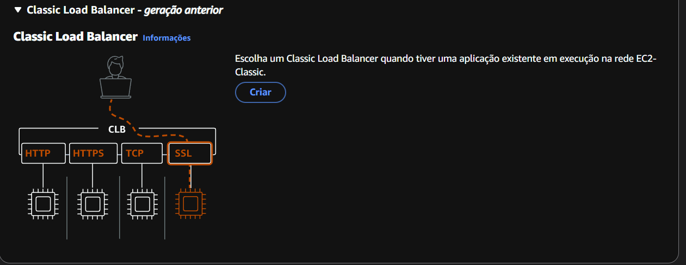
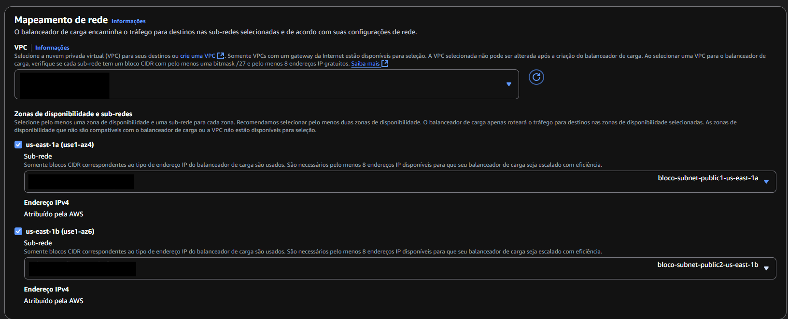

O objetivo deste projeto é executar um site WordPress em uma instância EC2 da AWS, utilizando o Amazon RDS para o banco de dados e o RDS database para o armazenamento de arquivos. Também utiliza o load balancer para distribuir o tráfego entre as instâncias EC2, garantindo alta disponibilidade e escalabilidade. Os pontos do projeto são: 

1. Instalação e configuração do DOCKER ou CONTAINERD no host EC2. 

* Ponto adiciconal para o trabalho utilizar a instalação via script de Start Instance 
 (user_data.sh). 

2. Efetuar Deploy de uma aplicação Wordpress com: 

* container de aplicação; 

* RDS database mysql. 

3. configuração da utilização do serviço EFS AWS para estáticos do container de aplicação Wordpress. 

4. configuração do serviço de Load Balancer AWS para a aplicação Wordpress. 

   *** Pontos de atenção: 

* não utilizar ip público para saída a do serviço WP (Evitem publicar o serviço WP via IP público); 

* sugestão de tráfego de internet sair pelo load balancer (Load Balancer Classic); 

* pastas públicas e estáticos do wordpress sugestão de utilizar o EFS (elastic file system); 

* Critério de utilizar  Dockerfile ou DockerCompose; 

* Necessário demonstrar a tela de login do WordPress; 

* Aplicação Wordpress precisa estar rodando na porta 80 ou 8080; 

* Utilizar repositório git para versionamento; 

* Criar documentação. 

 

## Tecnologias Utilizadas 

São utilizadas as seguintes tecnologias neste projeto: 

- AWS EC2   

- AWS RDS 

- AWS EFS 

- AWS Load Balancer 

- Docker 

- WordPress 

- MariaDB 

 

## Inicialização do Projeto 

O primeiro passo do projeto é montar os pontos de serviço conforme o diagrama abaixo: 

 

## Criando a aplicação 

O primeiro passo é iniciar uma aplicação na AWS para que possamos criar os serviços necessários. Pesquise por aplicação e insira as informações básicas como o nome, tags(se necessárias) e conclua a aplicação. Utilizar a aplicação facilita no gerenciamento dos serviços, principalmente após a conclusão em que se torna possível apagar todos os serviços de uma vez só. 

## Criando a VPC 

Para criar a VPC, pesquise por VPC e selecione a opção criar. Abrirá uma janela igual a mostrada abaixo.  

 

Utilize a opção VPC e muito mais para montar automaticamente toda rede incluindo a NAT, tabelas de rotas e conexões de rede. Utilize numero de AZs 2, número de redes públicas e privadas igual a 2 

 

adicione um gateway por AZ e aperte criar VPC.   

 

Precisamos agora criar os grupos de segurança. Na aba da VPC localize o item grupo de segurança 

 

Após isso selecione a opção criar grupo de segurança. 

Para o load balancer, adicione um nome referente à regra publica e configure com a seguinte regra: 

 

Para a EC2,nomeie o grupo de segurança reconhecível para entender que é voltado para conexao web (wordpress), selecione o grupo de segurança correto e configure o grupo de segurança de acordo com a imagem: 

 

onde a entrada e saída são o grupo de segurança do load balancer. 

Para o grupo de segurança do RDS adicionamos um nome associado ao RDS ou banco de dados, a VPC criada e usamos as seguintes regras 

 

onde a origem/destino é o grupo de segurança EC2 ou web. 

Para o EFS criamos o grupo de segurança com o nome associado a ele mesmo, selecionamos a VPC e adicionamos as seguintes regras: 

 

## Criando o LoadBalancer 

Para criar o LoadBalancer, pesquise por Load Balancer e selecione a opção Criar Load Balancer.  

 

Escolha a opção Classic Load Balancer e clique em Criar. 

Escolha a opção Load Balance Classic e clique em Criar. 

 

Adicione o nome identificável para o wordpress, selecione a opção voltado para internet, selecione o VPC criado anteriormente, as sub-redes publicas das zonas de disponibilidade distintas. 

 

Adicione o grupo de segurança associada à conexão pública. Será necessário retornar à configuração, uma vez que não há instâncias criadas ainda.  

 

## Criando o RDS 

Para criar o RDS, pesquise por RDS e selecione a opção Criar banco de dados. Selecione a opção MySQL e selecione as seguintes configurações: 

 

 

 

 

 

 

(selecione o grupo de segurança do banco de dados criado anteriormente) 

 

 

 

Após preenchida as informações, clique em Criar banco de dados. 

Uma vez criado, identifique o endpoint do banco de dados pois ele será necessário para montar a instância 

 

## Criando o EFS 

Para criar o EFS, pesquise por EFS e selecione a opção Criar sistema de arquivos. Selecione a opção personalizar 

 

Adicione um nome e selecione o tipo do sistema de arquivos regional, desabilite backups automáticos, desabilite criptografia, selecione a transição do infrequent access para 7 dias, transição para Archive para nenhum, transição para o padrão no primeiro acesso, configuração de performance intermitente, modo de desempenho para uso geral e vá para a próxima etapa.  

 

  

Após isto, insira a VPC criada, o ID da subrede e os grupos de segurança das zonas de disponibilidade usadas para o EFS. 

  

Selecione proximo e após isto criar. 

Uma vez criado, selecione a opção anexar no canto superior à direita e copie o código para montar usando NFS: 

 

Ele será usado para montar a instância. 

## Criação da Instância EC2 

Para criar as instâncias EC2, pesquise por EC2 e selecione a opção Iniciar instância. Escolha a imagem do Amazon Linux. Selecione o tipo de instância t2.micro, selecione o grupo de segurança da EC2, habilite solicitações de DNS IPv4 (registro A) com base em recursos, desabilite Recuperação automática de instância, selecione interromper caso comportamento de desligamento, desabilite interromper - comportamento de hibernação, desabilite proteção contra encerramento, desabilite interromper proteção, desabilite monitoramento do CloudWatch detalhado, deixe como padrão a especificação de crédito, como opção de compra selecione nenhum e como Dados de usuário utilize o seguinte código: 

```bash 
#!/bin/bash 

# caso usuario principal nao seja ubuntu e ainda seja uma distribuicao do ubuntu, garante que permaneca o usuario 

USER=$(whoami) 
PROJECT_DIR=/home/$USER/wordpress 

EFS_MOUNT_POINT=/mnt/efs/wordpress  

case "$USER" in
  ec2-user)
  sudo yum update 
  sudo yum install docker nfs-utils amazon-efs-utils -y;;
  ubuntu)
  sudo apt-get update 
  sudo apt-get install docker nfs-utils amazon-efs-utils -y;;
  *) shutdown now;;
esac
sudo systemctl start docker 
sudo systemctl enable docker 

sudo curl -L "https://github.com/docker/compose/releases/latest/download/docker-compose-$(uname -s)-$(uname -m)" -o /usr/local/bin/docker-compose 
sudo chmod +x /usr/local/bin/docker-compose 

sudo mkdir -p $PROJECT_DIR 
sudo mkdir -p $EFS_MOUNT_POINT 
sudo usermod -aG docker $USER

sudo chown -R $USER:$USER $PROJECT_DIR 
 

sudo tee -a /etc/fstab << GTV  
<efs>:/ efs nfs4 nfsvers=4.1,rsize=1048576,wsize=1048576,hard,timeo=600,retrans=2,noresvport,_netdev 0 0  
GTV 
sudo mount -a

while ! mountpoint -q /mnt/efs; do
  sleep 2
done

sudo tee /home/$USER/docker-compose.yml <<EOL 
services: 
  wordpress: 
    image: wordpress:6-php8.2 
    container_name: web 
    ports: 
      - 80:80 
    restart: always 
    environment: 
      WORDPRESS_DB_HOST: <rds> 
      WORDPRESS_DB_USER: <usuario_db>  
      WORDPRESS_DB_PASSWORD: <senha> 
      WORDPRESS_DB_NAME: wordpress 
    volumes: 
      - $EFS_MOUNT_POINT:/var/www/html  
EOL 

sudo chown $USER:$USER /home/$USER/docker-compose.yml 
cd /home/$USER 

while ! sudo -u $USER docker info &>/dev/null; do sleep 5; done 

sudo -u $USER docker-compose up -d 
sudo -u $USER docker exec -i web bash -c "cat <<EOF > /var/www/html/healthcheck.php 
<?php 

http_response_code(200); 

header('Content-Type: application/json'); 

echo json_encode([ status=> OK, message => Health check passed"]); 

exit; 

?> 

EOF" 
if  sudo -u $USER docker exec -i web ls /var/www/html/healthcheck.php > /dev/null 2>&1; then 
  echo "Arquivo healthcheck.php criado com sucesso!" 
fi 
``` 

Para que não haja falha na criação, editaremos a regra do healthcheck na AWS pois existe um falso negativo que indica que o servidor está pronto, ou seja, erro 302. 

Para isto, acesse   

## Configurando o load balancer 

Retornando ao load balancer, selecione o já criado e vá até a aba Instancias de destino. 

 

Ao selecionar a instancia original aparecerá em seguida na aba analisa instancias selecionadas 

 

Marque a caixa e selecione a opção salvar alterações. 

Para que não haja falha na criação, editaremos a regra do healthcheck na AWS pois existe um falso negativo que indica que o servidor está pronto, ou seja, erro 302. Para isto, acesse na aba do EC2 na sessão balanceamento de carga a opção grupos de destino 

   

Edite o grupo e escolha uma das opções: 

1. Alterar a página a ser executada o teste: 

A imagem do wordpress sempre responde com o status 200 e, portanto, é um bom alvo para contornar erros de validação caso a imagem esteja preparada para o seguinte caminho 

´´´ 

/wp-admin/images/wordpress-logo.svg 

´´´ 

na aba caminho da verificação de integridade conforme a imagem abaixo 

 

2. Alterar o código de acesso: 

Abaixo da opção anterior, em configurações avançadas de verificação de integridade altere a opção códigos de sucesso para  

``` 

200,302 

``` 

conforme a imagem abaixo 

 

## Auto scalling 

Após criar o template, crie o grupo de auto scalling. Adicione o grupo e selecione o template recém realizado e sua versão 

 

Selecione a VPC e as zonas de disponibilidade e subredes privadas. 

 

Selecione o balanceamento de carga para anexar um balanceamento de carga existente e selecione em anexar um balanceador de carga a opção escolher um classic load balancer e selecione o load balancer existente. Vá para a próxima etapa. 

 

Habilite a opção ative as verificações de integridade do Elastic Load Balancing e vá para a próxima etapa. 

 

Selecione a capacidade máxima de acordo com o solicitado pelo projeto 

 

Habilite a métrica do Cloudwatch e pule para a revisão. 

 

Uma vez criado verá que terá 2 instâncias e conforme a necessidade irá aumentar a contagem 

## Acessando a pagina 

Localize o dns do load balancer e cole em seu navegador. Você verá uma pagina como esta 

 

 
